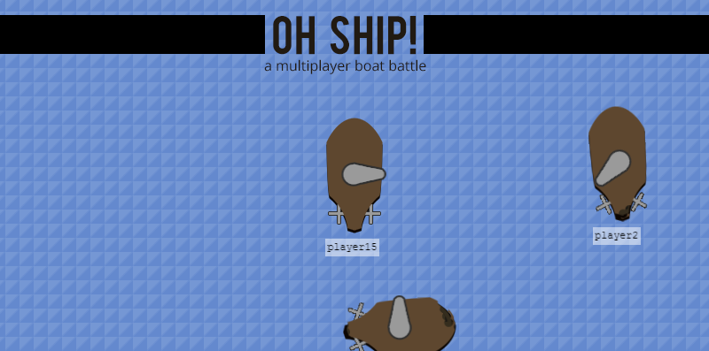

This is an early prototype multiplayer game built with websockets. There may be a demo [running here](http://kevinalbs.com:4080).

### Work to be done
- Reimplement server in C++ using [uWebSockets](https://github.com/uWebSockets/uWebSockets)
- Use compact messages (i.e. not JSON)
- Add score
- Fix bug where particles stay without moving
- Enforce uniqueness among nicknames
- Look into: state update is deferred in client ship, this seems fishy.
- Automate server and client tests
- Add boundary graphics
- Add ship spikes
- Add linear interpolation of masking for cannonball collision
- Change masking to jagged polygons instead of circles
- Add cannonball explosion effect
- Add visual effects for ocean
- Send only relevant (in region) messages to respective players
- Use running estimate of latency to predict when movement should occur to reduce error